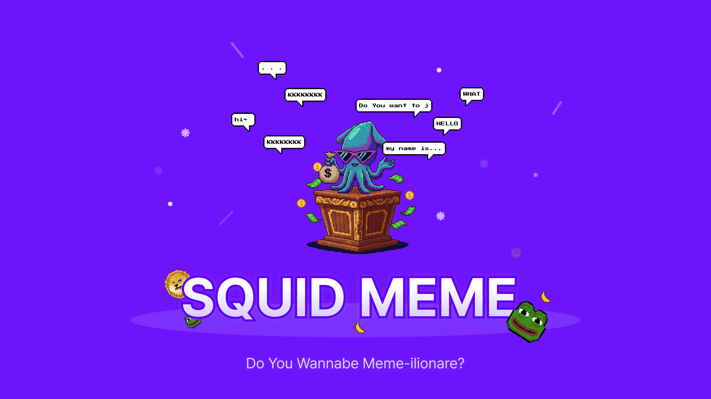
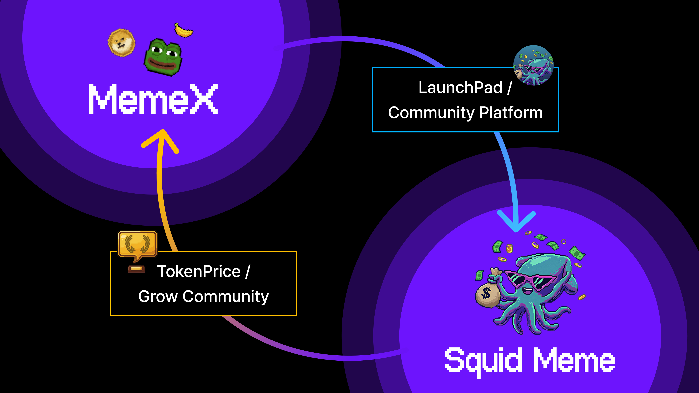

# Squid Meme

<div align="center">



> MemeCore에서 게이미피케이션을 통해 밈 코인에 실용성을 부여합니다

</div>

유휴 밈 토큰을 흥미진진한 소셜 경쟁으로 바꿔주는 Web3 게이밍 플랫폼으로, Chrome 확장 프로그램을 통해 MemeX 생태계에 원활하게 통합됩니다.

**한국어 | [English](./docs/README-english.md)**

---

## 목차

- [프로젝트 개요](#프로젝트-개요)
- [작동 방식](#작동-방식)
- [토크노믹스](#토크노믹스)
- [왜 Chrome 확장 프로그램인가?](#왜-chrome-확장-프로그램인가)
- [기능](#기능)
- [아키텍처](#아키텍처)
- [시작하기](#시작하기)
- [문서](#문서)
- [기대 효과](#기대-효과)

---

## 프로젝트 개요

### 문제점

밈 코인은 근본적인 문제에 직면해 있습니다: **실용성의 부재**. 초기 열풍이 지나가면, 토큰은 투기 목적 외에는 아무런 용도 없이 지갑에 방치됩니다. 이로 인해:

- 커뮤니티 참여도 감소
- 거래량 감소
- 홀더 관심도 하락
- 토큰 가치 하락

### 해결책

**Squid Meme**은 간단하지만 중독성 있는 게임 메커니즘을 통해 모든 밈 토큰에 즉각적인 실용성을 부여합니다: **마지막 댓글 작성자가 승리합니다**.

모든 밈 토큰이 이제 자체적인 경쟁 소셜 게임을 가질 수 있으며, 참여를 유도하고 실질적인 토큰 실용성을 창출합니다.

---

## 작동 방식

### 1. 게임: 마지막 댓글 작성자 승리


**간단한 규칙:**
1. **게임 시작** - 밈 토큰으로 상금 풀이 구성됩니다
2. **사용자 댓글 작성** - 각 댓글은 토큰을 소비하며 타이머를 리셋합니다
3. **타이머 종료** - 타이머가 만료되기 전에 아무도 댓글을 달지 않으면, 마지막 댓글 작성자가 상금 풀의 100%를 획득합니다

### 2. 펀더가 수익을 얻는 방법


**수수료 분배 예시:**
- 상금 풀: 1,000 토큰 (펀더 A: 60%, 펀더 B: 40%)
- 댓글 작성자 지불: 100 토큰
- 플랫폼 수령: 2 토큰 (2%)
- 펀더 A 수령: 58.8 토큰 (98%의 60%)
- 펀더 B 수령: 39.2 토큰 (98%의 40%)
- **타이머 종료 시 마지막 댓글 작성자가 전체 상금 풀 획득**

### 3. 지속 가능한 게임 경제


**선순환 구조:**
- **홀더**가 상금 풀에 자금 지원 → 큰 상금이 더 많은 플레이어 유치
- **플레이어**가 댓글에 토큰 지불 → 수수료의 98%가 홀더에게 환원
- **양측** 모두 토큰 실용성 강화 → 더 많은 거래, 더 많은 가치

---

## 토크노믹스

### 경제적 파라미터

| 파라미터 | 값 | 설명 |
|----------|------|------|
| 댓글 비용 | 총 펀딩의 0.01% | 상금 풀 기반 동적 가격 책정 |
| 플랫폼 수수료 | 2% | 지속 가능한 플랫폼 수익 |
| 펀더 보상 | 98% | 펀더에게 비례 배분 |
| 상금 분배 | 승자에게 100% | 마지막 댓글 작성자가 전체 풀 획득 |

### 인센티브 정렬

| 참여자 | 인센티브 | 행동 |
|--------|----------|------|
| **토큰 홀더** | 댓글 수수료로 패시브 인컴 획득 | 상금 풀 자금 지원 |
| **플레이어** | 큰 상금 획득 | 댓글로 경쟁 |
| **토큰 프로젝트** | 토큰 참여도 및 실용성 증가 | 토큰용 게임 생성 |
| **플랫폼** | 지속 가능한 2% 수익 | 게임 운영 |

### 이 경제가 지속되는 이유

1. **펀더 승리** - 수수료 공유를 통한 토큰 수익 획득
2. **플레이어 승리** - 큰 상금 획득 기회
3. **토큰 승리** - 실질적인 실용성이 가치를 높임
4. **모두가 이해관계를 가짐** - 정렬된 인센티브

---

## 왜 Chrome 확장 프로그램인가?

### 원활한 통합, 최대의 채택

사용자가 발견하고 방문해야 하는 또 다른 독립형 dApp을 구축하는 대신, Squid Meme은 밈 토큰 커뮤니티가 이미 존재하는 플랫폼인 **MemeX에 직접 주입**됩니다.

| 접근 방식 | 사용자 여정 | 마찰 |
|-----------|-------------|------|
| 독립형 dApp | 발견 → 방문 → 지갑 연결 → 토큰 찾기 → 플레이 | 높음 |
| **Chrome 확장 프로그램** | MemeX 프로필 방문 → 게임이 이미 존재 → 플레이 | **최소** |

### 장점

| 장점 | 설명 |
|------|------|
| **탐색 불필요** | 토큰 프로필 페이지에 게임이 자연스럽게 나타남 |
| **기존 사용자** | MemeX의 기존 커뮤니티 활용 |
| **맥락적** | 게임이 토큰 프로필에 직접 연결됨 |
| **바이럴** | 일반 브라우징을 통한 자연스러운 발견 |
| **신뢰** | 사용자가 익숙한 MemeX 도메인에 머무름 |

---

## 기능

### 핵심 게이밍

| 기능 | 설명 |
|------|------|
| **게임 생성** | 커스텀 기간과 펀딩으로 모든 MemeCore 토큰에 게임 생성 |
| **댓글 경쟁** | 토큰을 지불하여 댓글 작성; 각 댓글이 타이머 리셋 |
| **상금 청구** | 승자(마지막 댓글 작성자)가 전체 상금 풀 청구 |
| **상금 풀 펀딩** | 누구나 상금 풀에 추가하고 수수료 지분 획득 가능 |

### 소셜 기능

| 기능 | 설명 |
|------|------|
| **온체인 댓글** | 모든 댓글이 블록체인에 기록됨 |
| **좋아요 시스템** | 좋아요를 통한 댓글 참여 |
| **사용자 프로필** | 통계, 승리, 게임 히스토리 추적 |
| **리더보드** | 획득 상금, 댓글, 활동별 순위 |

### 퀘스트 & 보상

| 기능 | 설명 |
|------|------|
| **일일 체크인** | 보상을 위한 연속 출석 유지 (5일, 20일 마일스톤) |
| **댓글 목표** | 활동 마일스톤 달성 시 보상 획득 (20, 50 댓글) |
| **업적 시스템** | 플랫폼 전반의 성취 추적 |

### 대시보드 (사이드 패널)

| 기능 | 설명 |
|------|------|
| **라이브 게임** | 토큰별 모든 활성 게임 탐색 |
| **내 자산** | 토큰 보유량 및 가치 확인 |
| **프로필** | 개인 통계 및 게임 히스토리 |
| **퀘스트 트래커** | 퀘스트 진행 상황 모니터링 |

---

## 아키텍처

### 기술 스택

| 레이어 | 기술 |
|--------|------|
| **프론트엔드** | React 19, TypeScript, WXT, Wagmi, Viem, Jotai |
| **백엔드** | NestJS, TypeScript, Drizzle ORM, PostgreSQL |
| **컨트랙트** | Solidity 0.8.28, Hardhat 3, OpenZeppelin |
| **블록체인** | MemeCore (Formicarium Testnet) |
| **인프라** | Railway, Supabase |

### 레포지토리 구조

```
squid-meme/
├── frontend/     # Chrome 확장 프로그램 (React + WXT)
├── backend/      # API 서버 (NestJS)
├── contracts/    # 스마트 컨트랙트 (Solidity)
├── docs/         # 문서 & 이미지
└── README.md
```

---

## 시작하기

### 사전 요구 사항

- Node.js 18+
- npm
- PostgreSQL
- Chrome 브라우저

### 빠른 시작

```bash
# 레포지토리 클론
git clone https://github.com/your-org/squid-meme.git
cd squid-meme

# 모든 의존성 설치
npm install

# 백엔드 시작
cd backend && npm run start:dev

# 프론트엔드 확장 프로그램 시작 (새 터미널)
cd frontend && npm run dev

# Chrome에 로드
# chrome://extensions/ → 개발자 모드 → 압축해제된 확장 프로그램 로드 → frontend/.output/chrome-mv3
```

### 환경 설정

개별 README 참조:
- [백엔드 설정](./backend/README.md)
- [프론트엔드 설정](./frontend/README.md)
- [컨트랙트 설정](./contracts/README.md)

---

## 문서

| 문서 | 설명 |
|------|------|
| [백엔드 README](./backend/README.md) | API, 데이터베이스 스키마, 배포 |
| [프론트엔드 README](./frontend/README.md) | 확장 프로그램 아키텍처, Web3 통합 |
| [컨트랙트 README](./contracts/README.md) | 스마트 컨트랙트 메커니즘, 보안 |

### 네트워크 정보

| 속성 | 값 |
|------|------|
| 네트워크 | Formicarium Testnet (MemeCore) |
| Chain ID | 43521 |
| RPC | https://rpc.formicarium.memecore.net |
| Explorer | https://formicarium.memecorescan.io |

---

## 기대 효과

<div align="center">



</div>

### MemeX와의 시너지

Squid Meme은 MemeX 생태계와 긴밀하게 통합되어 양방향 가치를 창출합니다:

| 효과 | 설명 |
|------|------|
| **토큰 가치 상승** | 게임을 통한 실용성 부여로 토큰 수요 증가 |
| **커뮤니티 성장** | 재미있는 경쟁을 통한 활발한 커뮤니티 활동 |
| **LaunchPad 연동** | MemeX LaunchPad에서 출시된 토큰의 즉각적인 게임 지원 |
| **생태계 확장** | MemeCore 체인 전체의 활성 사용자 및 거래량 증가 |

---

<div align="center">

**Squid Meme** - *밈 코인을 다시 재미있게*

</div>
