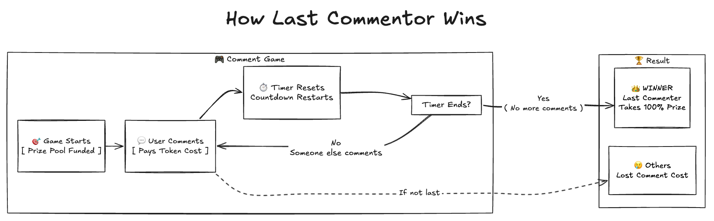
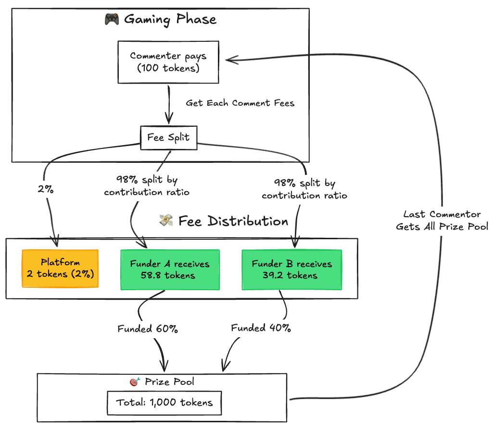
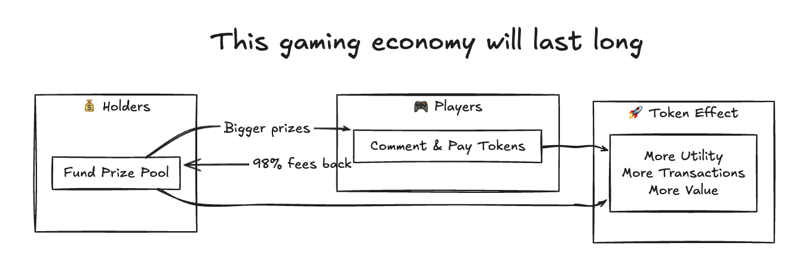
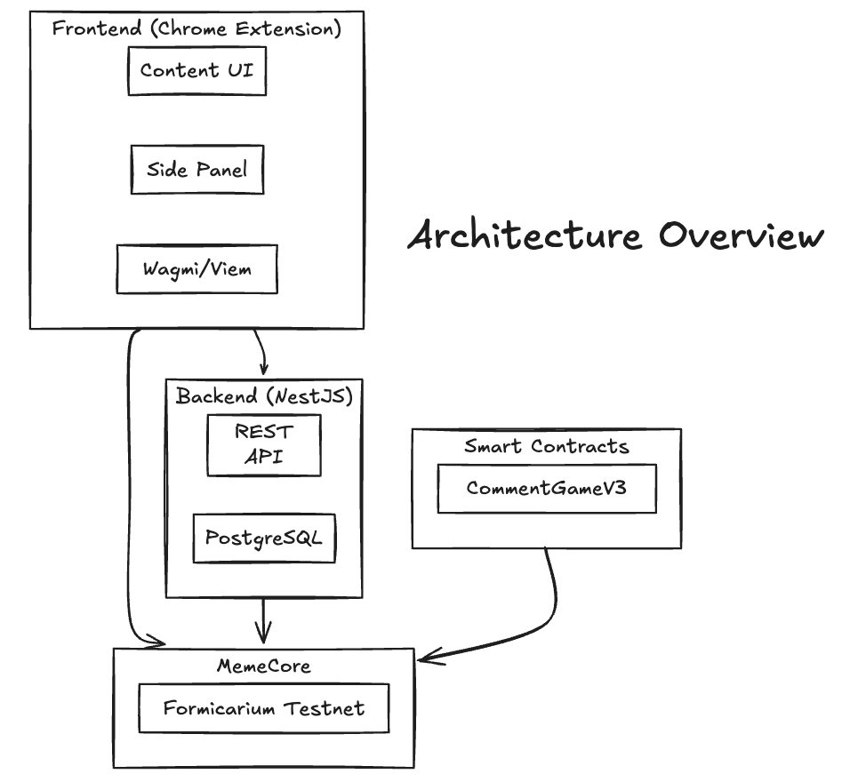

# Squid Meme

> Bringing utility to meme coins through gamification on MemeCore

A Web3 gaming platform that transforms idle meme tokens into engaging social competitions, seamlessly integrated into the MemeX ecosystem via Chrome Extension.

**[한국어](../README.md) | English**

---

## Table of Contents

- [Project Overview](#project-overview)
- [How It Works](#how-it-works)
- [Tokenomics](#tokenomics)
- [Why a Chrome Extension?](#why-a-chrome-extension)
- [Features](#features)
- [Architecture](#architecture)
- [Getting Started](#getting-started)
- [Documentation](#documentation)

---

## Project Overview

### The Problem

Meme coins face a fundamental challenge: **lack of utility**. After the initial hype fades, tokens sit idle in wallets with no purpose beyond speculation. This leads to:

- Declining community engagement
- Reduced trading volume
- Loss of holder interest
- Token value deterioration

### The Solution

**Squid Meme** creates instant utility for any meme token through a simple but addictive game mechanic: **The Last Comment Wins**.

Every meme token can now have its own competitive social game, driving engagement and creating real token utility.

---

## How It Works

### 1. The Game: Last Commenter Wins



**Simple Rules:**
1. **Game Starts** - Prize pool is funded with meme tokens
2. **Users Comment** - Each comment costs tokens and resets the timer
3. **Timer Ends** - When no one comments before timer expires, the last commenter wins 100% of the prize pool

### 2. How Funders Get Paid



**Fee Distribution Example:**
- Prize Pool: 1,000 tokens (Funder A: 60%, Funder B: 40%)
- Commenter pays: 100 tokens
- Platform receives: 2 tokens (2%)
- Funder A receives: 58.8 tokens (60% of 98%)
- Funder B receives: 39.2 tokens (40% of 98%)
- **Last Commenter wins entire Prize Pool when timer ends**

### 3. Sustainable Game Economy



**The Virtuous Cycle:**
- **Holders** fund prize pools → Bigger prizes attract more players
- **Players** pay to comment → 98% of fees go back to holders
- **Both** drive token utility → More transactions, more value

---

## Tokenomics

### Economic Parameters

| Parameter | Value | Description |
|-----------|-------|-------------|
| Comment Cost | 0.01% of Total Funding | Dynamic pricing based on prize pool |
| Platform Fee | 2% | Sustainable platform revenue |
| Funder Reward | 98% | Distributed proportionally to funders |
| Prize Distribution | 100% to Winner | Last commenter takes entire pool |

### Incentive Alignment

| Participant | Incentive | Action |
|-------------|-----------|--------|
| **Token Holders** | Earn passive income from comment fees | Fund prize pools |
| **Players** | Win large prizes | Compete by commenting |
| **Token Projects** | Increase token engagement & utility | Create games for their token |
| **Platform** | Sustainable 2% revenue | Facilitate games |

### Why This Economy Lasts

1. **Funders win** - Earn yield on their tokens through fee sharing
2. **Players win** - Chance to win big prizes
3. **Tokens win** - Real utility drives value
4. **Everyone has skin in the game** - Aligned incentives

---

## Why a Chrome Extension?

### Seamless Integration, Maximum Adoption

Instead of building yet another standalone dApp that users need to discover and visit, Squid Meme **injects directly into MemeX** — the platform where meme token communities already exist.

| Approach | User Journey | Friction |
|----------|-------------|----------|
| Standalone dApp | Discover → Visit → Connect Wallet → Find Token → Play | High |
| **Chrome Extension** | Visit MemeX Profile → Game is Already There → Play | **Minimal** |

### Benefits

| Benefit | Description |
|---------|-------------|
| **Zero Navigation** | Game appears naturally on token profile pages |
| **Existing Users** | Leverages MemeX's established community |
| **Contextual** | Game tied directly to token's profile |
| **Viral** | Natural discovery through normal browsing |
| **Trusted** | Users stay on familiar MemeX domain |

---

## Features

### Core Gaming

| Feature | Description |
|---------|-------------|
| **Create Game** | Launch a game on any MemeCore token with custom duration and funding |
| **Comment Competition** | Pay tokens to comment; each comment resets the timer |
| **Prize Claiming** | Winner (last commenter) claims the entire prize pool |
| **Fund Prize Pool** | Anyone can add to the prize pool and earn fee shares |

### Social Features

| Feature | Description |
|---------|-------------|
| **On-Chain Comments** | All comments recorded on blockchain |
| **Like System** | Engage with comments through likes |
| **User Profiles** | Track stats, wins, and game history |
| **Leaderboards** | Rankings by prizes won, comments, and activity |

### Quest & Rewards

| Feature | Description |
|---------|-------------|
| **Daily Check-in** | Maintain streaks for rewards (5-day, 20-day milestones) |
| **Comment Goals** | Earn rewards for activity milestones (20, 50 comments) |
| **Achievement System** | Track accomplishments across the platform |

### Dashboard (Side Panel)

| Feature | Description |
|---------|-------------|
| **Live Games** | Browse all active games across tokens |
| **My Assets** | View token holdings and values |
| **Profile** | Personal stats and game history |
| **Quest Tracker** | Monitor quest progress |

---

## Architecture

### System Overview



### Tech Stack

| Layer | Technology |
|-------|------------|
| **Frontend** | React 19, TypeScript, WXT, Wagmi, Viem, Jotai |
| **Backend** | NestJS, TypeScript, Drizzle ORM, PostgreSQL |
| **Contracts** | Solidity 0.8.28, Hardhat 3, OpenZeppelin |
| **Blockchain** | MemeCore (Formicarium Testnet) |
| **Infrastructure** | Railway, Supabase |

### Repository Structure

```
squid-meme/
├── frontend/     # Chrome Extension (React + WXT)
├── backend/      # API Server (NestJS)
├── contracts/    # Smart Contracts (Solidity)
├── docs/         # Documentation & Images
└── README.md
```

---

## Getting Started

### Prerequisites

- Node.js 18+
- npm
- PostgreSQL
- Chrome Browser

### Quick Start

```bash
# Clone repository
git clone https://github.com/your-org/squid-meme.git
cd squid-meme

# Install all dependencies
npm install

# Start backend
cd backend && npm run start:dev

# Start frontend extension (new terminal)
cd frontend && npm run dev

# Load in Chrome
# chrome://extensions/ → Developer mode → Load unpacked → frontend/.output/chrome-mv3
```

### Environment Setup

See individual READMEs:
- [Backend Setup](../backend/README.md)
- [Frontend Setup](../frontend/README.md)
- [Contracts Setup](../contracts/README.md)

---

## Documentation

| Document | Description |
|----------|-------------|
| [Backend README](../backend/README.md) | API, database schema, deployment |
| [Frontend README](../frontend/README.md) | Extension architecture, Web3 integration |
| [Contracts README](../contracts/README.md) | Smart contract mechanics, security |

### Network Information

| Property | Value |
|----------|-------|
| Network | Formicarium Testnet (MemeCore) |
| Chain ID | 43521 |
| RPC | https://rpc.formicarium.memecore.net |
| Explorer | https://formicarium.memecorescan.io |

---

<div align="center">

**Squid Meme** - *Making meme coins fun again*

</div>
