# 로그인 프로세스 상세 분석 문서

## 개요

이 문서는 Squid Meme Extension의 로그인 프로세스를 단계별로 분석한 상세 문서입니다. 사용자의 각 동작과 그에 따른 코드 실행, 데이터 흐름을 시퀀스 다이어그램과 함께 설명합니다.

---

## 1. 앱 초기화 단계

### 1.1 앱 시작 (App.tsx)

**위치**: `frontend/src/sidepanel/App.tsx`

**유저 동작**: 없음 (자동 실행)

**코드 동작**:

```12:20:frontend/src/sidepanel/App.tsx
export function SidePanelApp() {
    const { isConnected, address, isLoading } = useSidepanelWallet();
    const { isLoggedIn: isMemexLoggedIn, setLoggedIn: setMemexLoggedIn } = useMemexLogin();
    const [currentPage, setCurrentPage] = useState<Page>("dashboard");
    const [showStartingLoading, setShowStartingLoading] = useState(true);
```

**데이터 흐름**:
- `useSidepanelWallet()` 훅 호출 → 지갑 연결 상태 확인 시작
- `useMemexLogin()` 훅 호출 → MEMEX 로그인 상태 확인 시작
- `showStartingLoading` 상태가 `true`로 초기화

**저장 위치**: 
- `sessionAtom` (Jotai atom) - `sessionStorage`에 자동 동기화
- 키: `squid_session_state`

---

### 1.2 StartingLoading 표시

**위치**: `frontend/src/sidepanel/StartingLoading.tsx`

**유저 동작**: 없음 (자동 표시)

**코드 동작**:

```49:88:frontend/src/sidepanel/StartingLoading.tsx
export default function StartingLoading({ onComplete, duration = 3000 }: StartingLoadingProps) {
    const [hasPlayed, setHasPlayed] = useState(false);
    const imgRef = useRef<HTMLImageElement>(null);
    const timeoutRef = useRef<NodeJS.Timeout | null>(null);

    // 상단과 하단 별들 생성 (한 번만 생성)
    const [topStars] = useState(() => generateStars(30, { min: 0, max: 20 })); // 상단 0-20%
    const [bottomStars] = useState(() => generateStars(30, { min: 80, max: 100 })); // 하단 80-100%

    useEffect(() => {
        // 한 번만 실행되도록 체크
        if (hasPlayed) return;

        const handleImageLoad = () => {
            // 이미지가 로드된 후 지정된 시간만큼 대기 후 콜백 실행
            timeoutRef.current = setTimeout(() => {
                setHasPlayed(true);
                onComplete?.();
            }, duration);
        };
```

**데이터 흐름**:
- 시작 로딩 GIF 이미지 표시
- 3초 후 `onComplete` 콜백 호출

**저장 위치**: 없음 (UI 상태만)

---

### 1.3 지갑 상태 초기 확인

**위치**: `frontend/src/sidepanel/hooks/useSidepanelWallet.ts`

**유저 동작**: 없음 (자동 실행)

**코드 동작**:

```74:82:frontend/src/sidepanel/hooks/useSidepanelWallet.ts
    // 초기 상태 확인 (마운트 시 한 번만)
    useEffect(() => {
        if (initialCheckDone.current) {
            return;
        }
        initialCheckDone.current = true;
        checkAccount();
        // eslint-disable-next-line react-hooks/exhaustive-deps
    }, []);
```

**데이터 흐름**:
1. `checkAccount()` 호출
2. `backgroundApi.walletGetAccount()` → Background Script로 메시지 전송
3. Background Script가 Content Script를 통해 MetaMask 확인
4. 결과 반환: `{ isConnected: boolean, address: string | null }`
5. `setWalletConnectedAtom`으로 상태 업데이트

**저장 위치**: 
- `sessionAtom.walletAddress`
- `sessionAtom.isWalletConnected`
- 저장소: `sessionStorage['squid_session_state']`

---

### 1.4 MEMEX 로그인 상태 초기 확인

**위치**: `frontend/src/sidepanel/hooks/useMemexLogin.ts`

**유저 동작**: 없음 (자동 실행)

**코드 동작**:

```207:261:frontend/src/sidepanel/hooks/useMemexLogin.ts
  // 앱 시작 시 로그인 상태 확인 (Jotai atomWithStorage가 자동으로 저장소에서 불러옴)
  useEffect(() => {
    // 이미 체크 완료되었으면 스킵
    if (loginCheckCompleted) {
      return;
    }

    const performCheck = async () => {
      // 기존 세션에 username/userTag가 있어도 백엔드 통신 필요 (출석 체크)
      if (username && userTag) {
        console.log("🔐 [useMemexLogin] 기존 세션 데이터로 백엔드 조회:", {
          username,
          userTag,
        });

        try {
          const result = await backgroundApi.getUserByUsername(
            username,
            userTag
          );

          if (result.user) {
            setUser(result.user);
            setMemexLoggedIn({
              isLoggedIn: true,
              username: result.user.userName,
              userTag: result.user.userTag,
              profileImage: result.user.profileImage,
            });
            console.log(
              "✅ [useMemexLogin] 기존 세션 사용자 정보 조회 완료:",
              result.user
            );
          } else {
            // 백엔드에 유저가 없으면 로그인 상태 false
            setMemexLoggedIn({ isLoggedIn: false });
          }
        } catch (err) {
          console.warn(
            "⚠️ [useMemexLogin] 기존 세션 사용자 정보 조회 실패:",
            err
          );
          setMemexLoggedIn({ isLoggedIn: false });
        }
      } else {
        // username/userTag가 없으면 기존 checkLoginStatus 실행
        await checkLoginStatus();
      }

      setLoginCheckCompleted(true);
    };

    performCheck();
    // eslint-disable-next-line react-hooks/exhaustive-deps
  }, [loginCheckCompleted, username, userTag, setLoginCheckCompleted]);
```

**데이터 흐름**:
1. `sessionStorage`에서 기존 `username`, `userTag` 확인
2. 기존 데이터가 있으면:
   - `backgroundApi.getUserByUsername()` 호출
   - 백엔드에서 최신 user 정보 조회 (출석 체크 포함)
   - `setUser()` 및 `setMemexLoggedIn()`으로 상태 업데이트
3. 기존 데이터가 없으면:
   - `checkLoginStatus()` 실행 (GTM 키 확인)

**저장 위치**:
- `sessionAtom.isMemexLoggedIn`
- `sessionAtom.memexUsername`
- `sessionAtom.memexUserTag`
- `sessionAtom.user`
- 저장소: `sessionStorage['squid_session_state']`

---

## 2. ComingSoon 화면 표시

**위치**: `frontend/src/sidepanel/ComingSoon.tsx`

**유저 동작**: 없음 (자동 표시)

**코드 동작**:

```396:429:frontend/src/sidepanel/ComingSoon.tsx
    return (
        <div className="coming-soon-container">
            {/* Background Images - Dashboard와 동일 */}
            <div className="dashboard-background">
                
                
            </div>

            {/* 중상단: 이미지 미 로그 */}
            <div className="image-milog-text">
                이미지 미 로그
            </div>

            {/* 로딩 상태 표시 */}
            {isLoggingIn && (
                <div className="loading-overlay">
                    <div className="loading-spinner"></div>
                    <p className="loading-text">Loading...</p>
                </div>
            )}

            {/* 하단 중앙: CONNECT 버튼 */}
            {!isLoggingIn && (
                <>
                    <div className=""></div>
                    <button
                        className="connect-bottom-button"
                        onClick={handleConnect}
                        disabled={isLoading}
                    >
                        [ CONNECT {'>'}{'>'}{'>'} ]
                    </button>
                    <div className=""></div>
                </>
            )}
```

**조건**: `isConnected && isMemexLoggedIn`이 `false`인 경우

**데이터 흐름**: UI만 표시, 데이터 조작 없음

---

## 3. 사용자 로그인 시작

### 3.1 CONNECT 버튼 클릭

**위치**: `frontend/src/sidepanel/ComingSoon.tsx`

**유저 동작**: "[ CONNECT >>> ]" 버튼 클릭

**코드 동작**:

```66:69:frontend/src/sidepanel/ComingSoon.tsx
    const handleConnect = () => {
        // 약관 동의 모달 표시
        setIsTermsModalOpen(true);
    };
```

**데이터 흐름**:
- `isTermsModalOpen` 상태를 `true`로 변경
- TermsModal 컴포넌트가 표시됨

**저장 위치**: 로컬 React state (`useState`)

---

### 3.2 약관 동의 모달 표시

**위치**: `frontend/src/sidepanel/components/TermsModal.tsx`

**유저 동작**: 없음 (자동 표시)

**코드 동작**:

```7:35:frontend/src/sidepanel/components/TermsModal.tsx
export function TermsModal({ isOpen, onClose, onAgree }: TermsModalProps) {
    if (!isOpen) return null;

    return (
        <div className="terms-modal-overlay" onClick={onClose}>
            <div className="terms-modal" onClick={(e) => e.stopPropagation()}>
                <h2 className="terms-modal-title">Agreement Required</h2>
                <div className="terms-modal-text">
                    I AGREE TO THE{" "}
                    <a href="#" className="terms-link" onClick={(e) => e.preventDefault()}>
                        TERMS OF SERVICE
                    </a>{" "}
                    AND{" "}
                    <a href="#" className="terms-link" onClick={(e) => e.preventDefault()}>
                        PRIVACY POLICY
                    </a>
                </div>
                <div className="terms-modal-footer">
                    <button className="terms-btn terms-btn-decline" onClick={onClose}>
                        I Decline
                    </button>
                    <button className="terms-btn terms-btn-agree" onClick={onAgree}>
                        I Agree
                    </button>
                </div>
            </div>
        </div>
    );
}
```

**데이터 흐름**: UI만 표시, 데이터 조작 없음

---

### 3.3 약관 동의 버튼 클릭

**위치**: `frontend/src/sidepanel/ComingSoon.tsx`

**유저 동작**: "I Agree" 버튼 클릭

**코드 동작**:

```75:91:frontend/src/sidepanel/ComingSoon.tsx
    const handleAgreeTerms = async () => {
        setIsTermsModalOpen(false);
        try {
            // 1. 지갑 연결
            if (!isConnected) {
                await connect();
            }

            // 2. 지갑 연결 후 MEMEX 로그인 시작
            await handleMemexLogin();
        } catch (err) {
            console.error("Connection failed:", err);
            if (isContentScriptError(err)) {
                showRefreshSnackbar();
            }
        }
    };
```

**데이터 흐름**:
1. 약관 모달 닫기 (`setIsTermsModalOpen(false)`)
2. 지갑 연결 상태 확인
3. 연결되지 않았으면 `connect()` 호출
4. 지갑 연결 후 `handleMemexLogin()` 호출

---

### 3.4 지갑 연결 프로세스

**위치**: `frontend/src/sidepanel/hooks/useSidepanelWallet.ts`

**유저 동작**: 없음 (자동 실행, MetaMask 승인 필요)

**코드 동작**:

```84:104:frontend/src/sidepanel/hooks/useSidepanelWallet.ts
    const handleConnect = useCallback(async () => {
        console.log('🔐 [SidePanel] handleConnect 시작');
        setLoading(true);
        setError(null);

        try {
            console.log('🔐 [SidePanel] backgroundApi.walletConnect() 호출');
            const result = await backgroundApi.walletConnect();
            console.log('🔐 [SidePanel] walletConnect 결과:', result);

            setWalletConnected({ isConnected: true, address: result.address });
            setLoading(false);
            setError(null);
        } catch (err) {
            const errorMessage = err instanceof Error ? err.message : 'Failed to connect wallet';
            console.error('❌ [SidePanel] Wallet connection error:', err);
            setLoading(false);
            setError(errorMessage);
            throw err; // 호출자가 에러를 처리할 수 있도록 다시 throw
        }
    }, [setWalletConnected, setLoading, setError]);
```

**데이터 흐름**:

1. **SidePanel → Background Script**:
   - `backgroundApi.walletConnect()` 호출
   - 메시지 타입: `WALLET_CONNECT`

2. **Background Script → Content Script → Injected Script → MetaMask**:
   - MEMEX 웹사이트의 injected script가 MetaMask에 연결 요청
   - MetaMask 팝업에서 사용자 승인 대기

3. **MetaMask → Injected Script → Content Script → Background Script → SidePanel**:
   - 연결된 지갑 주소 반환: `{ address: string }`

4. **상태 업데이트**:
   - `setWalletConnectedAtom({ isConnected: true, address })`

**저장 위치**:
- `sessionAtom.walletAddress`
- `sessionAtom.isWalletConnected`
- 저장소: `sessionStorage['squid_session_state']`

---

## 4. MEMEX 로그인 프로세스

### 4.1 MEMEX 로그인 시작

**위치**: `frontend/src/sidepanel/ComingSoon.tsx`

**유저 동작**: 없음 (자동 실행)

**코드 동작**:

```93:181:frontend/src/sidepanel/ComingSoon.tsx
    const handleMemexLogin = async () => {
        try {
            console.log("🔐 MEMEX login started...");

            // 1. GTM 키 먼저 체크
            const cachedUserInfo = await getMemexUserInfo();

            if (cachedUserInfo) {
                // GTM 키가 있으면 바로 백엔드에서 user 정보 조회
                console.log("✅ GTM 키 발견, 백엔드에서 user 조회:", cachedUserInfo);
                setLoggingIn(true);

                try {
                    // 백엔드에서 user 정보 조회
                    const checkResult = (await backgroundApi.getUserByUsername(
                        cachedUserInfo.username,
                        cachedUserInfo.user_tag
                    )) as { user: User | null };

                    if (checkResult?.user && onMemexLoginComplete) {
                        console.log("✅ MEMEX 로그인 완료:", checkResult.user.userName);
                        setUser(checkResult.user);
                        setLoggingIn(false);
                        await refetch();
                        onMemexLoginComplete(cachedUserInfo.username, cachedUserInfo.user_tag);
                        return;
                    }

                    // 백엔드에 user가 없으면 신규 사용자 - 자동 회원가입 시도
                    console.log("🆕 [cachedUserInfo] 백엔드에 user 없음, 자동 회원가입 시도...");

                    // 1. 프로필 정보 fetch
                    const profileInfo = await backgroundApi.fetchMemexProfileInfo(
                        cachedUserInfo.username,
                        cachedUserInfo.user_tag
                    );
                    console.log("📋 [cachedUserInfo] 프로필 정보:", profileInfo);

                    // 2. 지갑 주소 확인
                    if (!address) {
                        console.warn("⚠️ [cachedUserInfo] 지갑 연결 필요");
                        setLoggingIn(false);
                        // 지갑 미연결 상태에서는 memexLogin으로 계속 진행
                    } else if (profileInfo?.profileImageUrl && profileInfo?.tokenAddr && profileInfo?.memexWalletAddress) {
                        // 3. 필수 정보 확인 후 Join 요청
                        const joinResult = await backgroundApi.join({
                            username: cachedUserInfo.username,
                            userTag: cachedUserInfo.user_tag,
                            walletAddress: address,
                            profileImageUrl: profileInfo.profileImageUrl,
                            memeXLink: `https://app.memex.xyz/profile/${cachedUserInfo.username}/${cachedUserInfo.user_tag}`,
                            myTokenAddr: profileInfo.tokenAddr,
                            myTokenSymbol: profileInfo.tokenSymbol || "",
                            memexWalletAddress: profileInfo.memexWalletAddress,
                            isPolicyAgreed: true,
                        });

                        if (joinResult?.user && onMemexLoginComplete) {
                            setUser(joinResult.user);
                            console.log("✅ [cachedUserInfo] 자동 회원가입 완료:", joinResult.user.userName);
                            setLoggingIn(false);
                            await refetch();
                            onMemexLoginComplete(cachedUserInfo.username, cachedUserInfo.user_tag);
                            return;
                        }
                    } else {
                        console.warn("⚠️ [cachedUserInfo] 프로필 정보 부족, 회원가입 불가:", {
                            profileImageUrl: profileInfo?.profileImageUrl,
                            tokenAddr: profileInfo?.tokenAddr,
                            memexWalletAddress: profileInfo?.memexWalletAddress,
                        });
                    }

                    // 회원가입 실패 시 memexLogin으로 계속 진행
                    console.log("⚠️ [cachedUserInfo] 자동 회원가입 실패, memexLogin으로 계속 진행...");
                    setLoggingIn(false);
                } catch (err) {
                    console.error("❌ [cachedUserInfo] 처리 실패:", err);
                    setLoggingIn(false);
                    if (isContentScriptError(err)) {
                        showRefreshSnackbar();
                        return;
                    }
                }
            } else {
                // GTM 키가 없으면 app.memex.xyz로 이동하여 Google 로그인 버튼 클릭
                console.log("🔐 GTM 키 없음, Google 로그인 시작...");
            }
```

**데이터 흐름**:

1. **GTM 키 확인**:
   - `getMemexUserInfo()` 호출
   - `sessionStorage['gtm_user_identifier']`에서 username, userTag 읽기

2. **경로 A: GTM 키가 있는 경우**:
   - 백엔드에서 user 정보 조회
   - 있으면: 로그인 완료
   - 없으면: 자동 회원가입 시도 (프로필 정보 fetch → Join 요청)

3. **경로 B: GTM 키가 없는 경우**:
   - Google 로그인 프로세스 시작 (4.2로 이동)

---

### 4.2 GTM 키가 없는 경우: Google 로그인 시작

**위치**: `frontend/src/sidepanel/ComingSoon.tsx`

**유저 동작**: 없음 (자동 실행, MEMEX 웹사이트에서 Google 로그인 필요)

**코드 동작**:

```182:202:frontend/src/sidepanel/ComingSoon.tsx
            // 2. GTM 키가 없거나, 있어도 프로필에서 로그인 확인 실패 시 Google 로그인 시도
            const result = (await backgroundApi.memexLogin(true)) as {
                success: boolean;
                isLoggedIn?: boolean;
                loginStarted?: boolean;
                username?: string;
                userTag?: string;
                error?: string;
            };
            console.log("🔐 MEMEX login result:", result);

            // Content script 연결 오류 체크 (응답에 error 필드가 있는 경우)
            if (
                result?.error &&
                (result.error.toLowerCase().includes("receiving end does not exist") ||
                    result.error.toLowerCase().includes("could not establish connection"))
            ) {
                console.log("⚠️ Content script 연결 오류, 스낵바 표시");
                showRefreshSnackbar();
                return;
            }
```

**데이터 흐름**:

1. **SidePanel → Background Script**:
   - `backgroundApi.memexLogin(true)` 호출 (`triggerLogin: true`)
   - 메시지 타입: `MEMEX_LOGIN`

2. **Background Script → Content Script**:
   - MEMEX 웹사이트 탭의 content script로 메시지 전달

3. **Content Script → MEMEX 웹사이트**:
   - `app.memex.xyz`에서 Google 로그인 버튼 찾기
   - 버튼이 없으면 탭 이동 (`app.memex.xyz`로 이동)
   - Google 로그인 버튼 클릭 시뮬레이션

4. **응답 반환**:
   - `{ loginStarted: true }` - 로그인 시작됨
   - `{ isLoggedIn: true, username, userTag }` - 이미 로그인되어 있음
   - `{ error: string }` - 에러 발생 (예: MEMEX 탭이 없음)

**저장 위치**: 없음 (비동기 처리)

---

### 4.3 로그인 완료 확인 (이미 로그인된 경우)

**위치**: `frontend/src/sidepanel/ComingSoon.tsx`

**유저 동작**: 없음 (자동 확인)

**코드 동작**:

```204:271:frontend/src/sidepanel/ComingSoon.tsx
            // 이미 로그인되어 있으면 백엔드에서 user 정보 조회 후 완료
            if (result?.isLoggedIn && result.username && result.userTag && onMemexLoginComplete) {
                console.log("🔐 GTM 로그인 확인됨, 백엔드에서 user 정보 조회:", result.username);
                try {
                    const userResult = await backgroundApi.getUserByUsername(
                        result.username,
                        result.userTag
                    );
                    if (userResult?.user) {
                        setUser(userResult.user);
                        console.log("✅ MEMEX 로그인 완료:", userResult.user.userName);
                        setLoggingIn(false);
                        onMemexLoginComplete(result.username, result.userTag);
                        return;
                    }

                    // 백엔드에 user가 없으면 신규 사용자 - 자동 회원가입 시도
                    console.log("🆕 백엔드에 user 없음, 자동 회원가입 시도...");
                    setLoggingIn(true);

                    // 1. 프로필 정보 fetch
                    const profileInfo = await backgroundApi.fetchMemexProfileInfo(
                        result.username,
                        result.userTag
                    );
                    console.log("📋 프로필 정보:", profileInfo);

                    // 2. 지갑 주소 확인
                    if (!address) {
                        console.warn("⚠️ 지갑 연결 필요");
                        setLoggingIn(false);
                        return;
                    }

                    // 3. 필수 정보 확인 후 Join 요청
                    if (profileInfo?.profileImageUrl && profileInfo?.tokenAddr && profileInfo?.memexWalletAddress) {
                        const joinResult = await backgroundApi.join({
                            username: result.username,
                            userTag: result.userTag,
                            walletAddress: address,
                            profileImageUrl: profileInfo.profileImageUrl,
                            memeXLink: `https://app.memex.xyz/profile/${result.username}/${result.userTag}`,
                            myTokenAddr: profileInfo.tokenAddr,
                            myTokenSymbol: profileInfo.tokenSymbol || "",
                            memexWalletAddress: profileInfo.memexWalletAddress,
                            isPolicyAgreed: true,
                        });

                        if (joinResult?.user) {
                            setUser(joinResult.user);
                            console.log("✅ 자동 회원가입 완료:", joinResult.user.userName);
                            setLoggingIn(false);
                            onMemexLoginComplete(result.username, result.userTag);
                            return;
                        }
                    } else {
                        console.warn("⚠️ 프로필 정보 부족, 회원가입 불가:", {
                            profileImageUrl: profileInfo?.profileImageUrl,
                            tokenAddr: profileInfo?.tokenAddr,
                            memexWalletAddress: profileInfo?.memexWalletAddress,
                        });
                    }
                    setLoggingIn(false);
                } catch (userErr) {
                    console.warn("⚠️ User 정보 조회/회원가입 실패:", userErr);
                    setLoggingIn(false);
                }
            }
```

**데이터 흐름**:

1. **백엔드에서 user 조회**:
   - `backgroundApi.getUserByUsername(username, userTag)`
   - API 호출: `GET /api/users/by-username?username=...&userTag=...`

2. **user가 있는 경우**:
   - `setUser(userResult.user)` - user 정보 저장
   - `onMemexLoginComplete()` 호출

3. **user가 없는 경우 (신규 사용자)**:
   - 프로필 정보 fetch → Join 요청 (4.5로 이동)

**저장 위치**:
- `sessionAtom.user` - 백엔드에서 받은 User 객체
- 저장소: `sessionStorage['squid_session_state']`

---

### 4.4 로그인 시작 후 폴링 (Google 로그인 진행 중)

**위치**: `frontend/src/sidepanel/ComingSoon.tsx`

**유저 동작**: MEMEX 웹사이트에서 Google 로그인 완료

**코드 동작**:

```273:381:frontend/src/sidepanel/ComingSoon.tsx
            // 로그인 시작됨 - 폴링으로 로그인 완료 확인
            if (result?.loginStarted) {
                console.log("🔐 Google 로그인 시작됨, 폴링 시작...");
                setLoggingIn(true);
                const maxWaitTime = 60000; // 60초
                const pollInterval = 2000; // 2초
                const startTime = Date.now();

                const checkLoginStatus = async (): Promise<void> => {
                    const elapsed = Date.now() - startTime;
                    if (elapsed >= maxWaitTime) {
                        console.error("❌ 로그인 타임아웃");
                        setLoggingIn(false);
                        return;
                    }

                    try {
                        const checkResult = (await backgroundApi.memexLogin()) as {
                            success: boolean;
                            isLoggedIn?: boolean;
                            username?: string;
                            userTag?: string;
                        };
                        console.log(
                            "🔐 로그인 상태 확인:",
                            checkResult,
                            Math.floor(elapsed / 1000),
                            "초 경과"
                        );

                        if (checkResult?.isLoggedIn && checkResult.username && checkResult.userTag && onMemexLoginComplete) {
                            console.log("🔐 GTM 로그인 확인됨, 백엔드에서 user 정보 조회:", checkResult.username);

                            // 백엔드에서 user 정보 가져오기 - user가 있어야만 로그인 완료
                            try {
                                const userResult = await backgroundApi.getUserByUsername(
                                    checkResult.username,
                                    checkResult.userTag
                                );
                                if (userResult?.user) {
                                    setUser(userResult.user);
                                    console.log("✅ MEMEX 로그인 완료:", userResult.user.userName);
                                    setLoggingIn(false);
                                    await refetch();
                                    onMemexLoginComplete(checkResult.username, checkResult.userTag);
                                    return;
                                }

                                // 백엔드에 user 없음 - 자동 회원가입 시도
                                console.log("🆕 백엔드에 user 없음, 자동 회원가입 시도...");

                                // 1. 프로필 정보 fetch
                                const profileInfo = await backgroundApi.fetchMemexProfileInfo(
                                    checkResult.username,
                                    checkResult.userTag
                                );
                                console.log("📋 프로필 정보:", profileInfo);

                                // 2. 지갑 주소 확인
                                if (!address) {
                                    console.warn("⚠️ 지갑 연결 필요, 폴링 계속...");
                                    setTimeout(checkLoginStatus, pollInterval);
                                    return;
                                }

                                // 3. 필수 정보 확인 후 Join 요청
                                if (profileInfo?.profileImageUrl && profileInfo?.tokenAddr && profileInfo?.memexWalletAddress) {
                                    const joinResult = await backgroundApi.join({
                                        username: checkResult.username,
                                        userTag: checkResult.userTag,
                                        walletAddress: address,
                                        profileImageUrl: profileInfo.profileImageUrl,
                                        memeXLink: `https://app.memex.xyz/profile/${checkResult.username}/${checkResult.userTag}`,
                                        myTokenAddr: profileInfo.tokenAddr,
                                        myTokenSymbol: profileInfo.tokenSymbol || "",
                                        memexWalletAddress: profileInfo.memexWalletAddress,
                                        isPolicyAgreed: true,
                                    });

                                    if (joinResult?.user) {
                                        setUser(joinResult.user);
                                        console.log("✅ 자동 회원가입 완료:", joinResult.user.userName);
                                        setLoggingIn(false);
                                        await refetch();
                                        onMemexLoginComplete(checkResult.username, checkResult.userTag);
                                        return;
                                    }
                                } else {
                                    console.warn("⚠️ 프로필 정보 부족, 폴링 계속:", {
                                        profileImageUrl: profileInfo?.profileImageUrl,
                                        tokenAddr: profileInfo?.tokenAddr,
                                        memexWalletAddress: profileInfo?.memexWalletAddress,
                                    });
                                }
                            } catch (userErr) {
                                console.warn("⚠️ User 정보 조회/회원가입 실패, 폴링 계속:", userErr);
                            }
                        }

                        // 아직 로그인 안됨, 다시 체크
                        setTimeout(checkLoginStatus, pollInterval);
                    } catch (err) {
                        console.log("🔐 로그인 확인 중 오류 (재시도):", err);
                        setTimeout(checkLoginStatus, pollInterval);
                    }
                };

                // 5초 후 폴링 시작 (Google 로그인 완료 시간 대기)
                setTimeout(checkLoginStatus, 5000);
            }
```

**데이터 흐름**:

1. **폴링 시작**:
   - 5초 대기 후 첫 폴링 시작
   - 이후 2초마다 반복 (최대 60초)

2. **각 폴링마다**:
   - `backgroundApi.memexLogin()` 호출 (triggerLogin: false)
   - MEMEX 웹사이트의 `sessionStorage['gtm_user_identifier']` 확인
   - GTM 키가 있으면: `{ isLoggedIn: true, username, userTag }` 반환

3. **로그인 확인되면**:
   - 백엔드에서 user 조회
   - 있으면: 로그인 완료
   - 없으면: 자동 회원가입 시도

**저장 위치**: 없음 (폴링 중)

---

### 4.5 자동 회원가입 (신규 사용자)

**위치**: `frontend/src/sidepanel/ComingSoon.tsx`

**유저 동작**: 없음 (자동 실행)

**코드 동작**:

회원가입은 다음 3단계로 진행됩니다:

1. **프로필 정보 Fetch**:
```typescript
const profileInfo = await backgroundApi.fetchMemexProfileInfo(
    username,
    userTag
);
```

2. **지갑 주소 확인**:
```typescript
if (!address) {
    // 지갑 미연결 시 에러 또는 대기
    return;
}
```

3. **Join 요청**:
```typescript
const joinResult = await backgroundApi.join({
    username: cachedUserInfo.username,
    userTag: cachedUserInfo.user_tag,
    walletAddress: address,
    profileImageUrl: profileInfo.profileImageUrl,
    memeXLink: `https://app.memex.xyz/profile/${username}/${userTag}`,
    myTokenAddr: profileInfo.tokenAddr,
    myTokenSymbol: profileInfo.tokenSymbol || "",
    memexWalletAddress: profileInfo.memexWalletAddress,
    isPolicyAgreed: true,
});
```

**데이터 흐름**:

#### 4.5.1 프로필 정보 Fetch

1. **SidePanel → Background Script**:
   - `backgroundApi.fetchMemexProfileInfo(username, userTag)`
   - 메시지 타입: `FETCH_MEMEX_PROFILE_INFO`

2. **Background Script → Content Script → MEMEX 웹사이트**:
   - MEMEX 프로필 페이지 (`app.memex.xyz/profile/${username}/${userTag}`) 방문
   - DOM에서 다음 정보 추출:
     - 프로필 이미지 URL
     - 토큰 주소 (`myTokenAddr`)
     - 토큰 심볼 (`myTokenSymbol`)
     - 토큰 이미지 URL
     - MEMEX 지갑 주소 (`memexWalletAddress`)

3. **응답 반환**:
```typescript
{
    profileImageUrl: string | null;
    tokenAddr: string | null;
    tokenSymbol: string | null;
    tokenImageUrl: string | null;
    memexWalletAddress: string | null;
}
```

#### 4.5.2 Join 요청

1. **SidePanel → Background Script**:
   - `backgroundApi.join(joinData)`
   - 메시지 타입: `JOIN`

2. **Background Script → 백엔드 API**:
   - `POST /api/users/join`
   - 요청 본문:
```json
{
    "username": string,
    "userTag": string,
    "walletAddress": string,
    "profileImageUrl": string,
    "memeXLink": string,
    "myTokenAddr": string,
    "myTokenSymbol": string,
    "memexWalletAddress": string,
    "isPolicyAgreed": boolean
}
```

3. **백엔드 처리**:
   - 사용자 생성 또는 업데이트
   - 출석 체크 (오늘 첫 로그인 시)

4. **응답 반환**:
```typescript
{
    user: User; // User 객체
}
```

5. **상태 업데이트**:
   - `setUser(joinResult.user)`

**저장 위치**:
- 백엔드 데이터베이스 (PostgreSQL)
- `sessionAtom.user` - 백엔드에서 받은 User 객체
- 저장소: `sessionStorage['squid_session_state']`

---

### 4.6 useMemexLogin의 자동 Join 처리

**위치**: `frontend/src/sidepanel/hooks/useMemexLogin.ts`

**유저 동작**: 없음 (자동 실행)

**코드 동작**:

모든 필수 데이터가 준비되면 자동으로 Join 요청을 보냅니다:

```263:297:frontend/src/sidepanel/hooks/useMemexLogin.ts
  // sessionStore의 모든 필수 데이터가 준비되면 자동으로 Join 요청
  useEffect(() => {
    // 이미 User 정보가 있거나 요청 중이면 스킵
    if (user || joinRequestInProgress) {
      return;
    }

    // 모든 필수 데이터가 있는지 확인
    const allDataReady =
      isLoggedIn &&
      username &&
      userTag &&
      walletAddress &&
      profileImageUrl &&
      myTokenAddr &&
      myTokenSymbol &&
      memexWalletAddress;

    if (allDataReady) {
      console.log("✅ [useMemexLogin] 모든 데이터 준비됨, Join 요청 시작");
      sendJoinRequest();
    }
    // sendJoinRequest는 useCallback으로 메모이제이션되어 있으므로 의존성에서 제외
    // eslint-disable-next-line react-hooks/exhaustive-deps
  }, [
    user,
    isLoggedIn,
    username,
    userTag,
    walletAddress,
    profileImageUrl,
    myTokenAddr,
    myTokenSymbol,
    memexWalletAddress,
  ]);
```

**데이터 흐름**:

1. **조건 확인**:
   - `user`가 없고
   - `joinRequestInProgress`가 `false`이고
   - 모든 필수 데이터가 준비되어 있으면

2. **Join 요청 전송**:
   - `sendJoinRequest()` 호출
   - `backgroundApi.join()` 실행

3. **상태 업데이트**:
   - `setUser(response.user)`

**저장 위치**:
- 백엔드 데이터베이스
- `sessionAtom.user`
- 저장소: `sessionStorage['squid_session_state']`

---

## 5. 로그인 완료

### 5.1 로그인 완료 콜백 호출

**위치**: `frontend/src/sidepanel/ComingSoon.tsx` → `frontend/src/sidepanel/App.tsx`

**유저 동작**: 없음 (자동 실행)

**코드 동작**:

```27:31:frontend/src/sidepanel/App.tsx
    // MEMEX 로그인 완료 핸들러
    const handleMemexLoginComplete = (username: string, userTag: string) => {
        console.log("🔐 [App] handleMemexLoginComplete 호출됨:", { username, userTag });
        setMemexLoggedIn(true, username, userTag);
    };
```

**데이터 흐름**:

1. `onMemexLoginComplete(username, userTag)` 호출
2. `App.tsx`의 `handleMemexLoginComplete()` 실행
3. `setMemexLoggedIn(true, username, userTag)` 호출
4. `sessionAtom` 상태 업데이트

**저장 위치**:
- `sessionAtom.isMemexLoggedIn = true`
- `sessionAtom.memexUsername = username`
- `sessionAtom.memexUserTag = userTag`
- 저장소: `sessionStorage['squid_session_state']`

---

### 5.2 Dashboard 표시

**위치**: `frontend/src/sidepanel/App.tsx`

**유저 동작**: 없음 (자동 표시)

**코드 동작**:

```44:95:frontend/src/sidepanel/App.tsx
    // 지갑 연결 + MEMEX 로그인 완료 시 대시보드 또는 프로필
    if (isConnected && isMemexLoggedIn) {
        if (currentPage === "profile") {
            return (
                <ProfilePage
                    walletAddress={address || undefined}
                    onBack={() => setCurrentPage("dashboard")}
                    onNavigateToMyAssets={() => setCurrentPage("myAssets")}
                />
            );
        }
        if (currentPage === "leaderboard") {
            return (
                <LeaderboardPage
                    onBack={() => setCurrentPage("dashboard")}
                    onNavigateToProfile={() => setCurrentPage("profile")}
                />
            );
        }
        if (currentPage === "liveGames") {
            return (
                <LiveGamesPage
                    onBack={() => setCurrentPage("dashboard")}
                    onNavigateToProfile={() => setCurrentPage("profile")}
                />
            );
        }
        if (currentPage === "myAssets") {
            return (
                <MyAssetsPage
                    onBack={() => setCurrentPage("dashboard")}
                    onNavigateToProfile={() => setCurrentPage("profile")}
                />
            );
        }
        return (
            <Dashboard
                walletAddress={address || undefined}
                onNavigateToProfile={() => setCurrentPage("profile")}
                onNavigateToLeaderboard={() => setCurrentPage("leaderboard")}
                onNavigateToLiveGames={() => setCurrentPage("liveGames")}
                onNavigateToMyAssets={() => setCurrentPage("myAssets")}
                onNavigateToHowToPlay={() => {
                    // TODO: How to Play 페이지 구현
                    console.log("How to Play clicked");
                }}
                onNavigateToQuest={() => {
                    // TODO: Quest 페이지 구현
                    console.log("Quest clicked");
                }}
            />
        );
    }

    return <ComingSoon onMemexLoginComplete={handleMemexLoginComplete} />;
```

**조건**: `isConnected && isMemexLoggedIn === true`

**데이터 흐름**: Dashboard 컴포넌트 렌더링

---

## 6. 시퀀스 다이어그램

### 6.1 전체 로그인 프로세스

```mermaid
sequenceDiagram
    participant User as 사용자
    participant App as App.tsx
    participant StartingLoading as StartingLoading
    participant ComingSoon as ComingSoon.tsx
    participant Wallet as useSidepanelWallet
    participant MemexLogin as useMemexLogin
    participant TermsModal as TermsModal
    participant Background as Background Script
    participant Content as Content Script
    participant Memex as MEMEX 웹사이트
    participant MetaMask as MetaMask
    participant Backend as 백엔드 API

    Note over App,Backend: 1. 앱 초기화
    App->>StartingLoading: 렌더링 (3초)
    App->>Wallet: useSidepanelWallet() 훅 호출
    App->>MemexLogin: useMemexLogin() 훅 호출
    
    Wallet->>Background: walletGetAccount()
    Background->>Content: 지갑 상태 확인
    Content->>MetaMask: 계정 조회
    MetaMask-->>Content: address 반환
    Content-->>Background: { address, isConnected }
    Background-->>Wallet: { address, isConnected }
    Wallet->>Wallet: setWalletConnectedAtom()
    
    MemexLogin->>MemexLogin: sessionStorage에서 username/userTag 확인
    alt 기존 세션 있음
        MemexLogin->>Background: getUserByUsername(username, userTag)
        Background->>Backend: GET /api/users/by-username
        Backend-->>Background: User 객체
        Background-->>MemexLogin: { user: User }
        MemexLogin->>MemexLogin: setUser(), setMemexLoggedIn()
    else 기존 세션 없음
        MemexLogin->>Background: memexLogin()
        Background->>Content: GTM 키 확인
        Content->>Memex: sessionStorage 확인
        Memex-->>Content: GTM 키 없음
        Content-->>Background: { isLoggedIn: false }
        Background-->>MemexLogin: { isLoggedIn: false }
    end
    
    StartingLoading->>App: onComplete() (3초 후)
    App->>ComingSoon: 렌더링
    
    Note over User,Backend: 2. 사용자 로그인 시작
    User->>ComingSoon: "[ CONNECT >>> ]" 버튼 클릭
    ComingSoon->>TermsModal: 모달 표시
    
    User->>TermsModal: "I Agree" 버튼 클릭
    TermsModal->>ComingSoon: onAgree() 호출
    
    ComingSoon->>Wallet: connect() 호출
    Wallet->>Background: walletConnect()
    Background->>Content: 지갑 연결 요청
    Content->>MetaMask: 연결 요청
    MetaMask->>User: 승인 팝업 표시
    User->>MetaMask: 승인
    MetaMask-->>Content: { address }
    Content-->>Background: { address }
    Background-->>Wallet: { address }
    Wallet->>Wallet: setWalletConnectedAtom()
    
    ComingSoon->>ComingSoon: handleMemexLogin() 시작
    
    Note over ComingSoon,Backend: 3. MEMEX 로그인 프로세스
    ComingSoon->>ComingSoon: getMemexUserInfo() 호출
    ComingSoon->>ComingSoon: sessionStorage['gtm_user_identifier'] 확인
    
    alt GTM 키 있음
        ComingSoon->>Background: getUserByUsername()
        Background->>Backend: GET /api/users/by-username
        alt 백엔드에 user 있음
            Backend-->>Background: { user: User }
            Background-->>ComingSoon: { user: User }
            ComingSoon->>ComingSoon: setUser(), onMemexLoginComplete()
        else 백엔드에 user 없음 (신규)
            Backend-->>Background: { user: null }
            Background-->>ComingSoon: { user: null }
            ComingSoon->>Background: fetchMemexProfileInfo()
            Background->>Content: 프로필 정보 요청
            Content->>Memex: 프로필 페이지 방문
            Memex-->>Content: 프로필 정보 (이미지, 토큰 등)
            Content-->>Background: 프로필 정보
            Background-->>ComingSoon: 프로필 정보
            ComingSoon->>Background: join() 요청
            Background->>Backend: POST /api/users/join
            Backend->>Backend: 사용자 생성/업데이트, 출석 체크
            Backend-->>Background: { user: User }
            Background-->>ComingSoon: { user: User }
            ComingSoon->>ComingSoon: setUser(), onMemexLoginComplete()
        end
    else GTM 키 없음
        ComingSoon->>Background: memexLogin(true) - Google 로그인 시작
        Background->>Content: Google 로그인 버튼 클릭
        Content->>Memex: Google 로그인 버튼 클릭 시뮬레이션
        Memex->>User: Google 로그인 화면 표시
        User->>Memex: Google 로그인 완료
        Memex->>Memex: sessionStorage['gtm_user_identifier'] 저장
        
        ComingSoon->>ComingSoon: 폴링 시작 (5초 후, 2초마다)
        loop 폴링 (최대 60초)
            ComingSoon->>Background: memexLogin() - GTM 키 확인
            Background->>Content: GTM 키 확인
            Content->>Memex: sessionStorage 확인
            alt GTM 키 아직 없음
                Memex-->>Content: GTM 키 없음
                Content-->>Background: { isLoggedIn: false }
                Background-->>ComingSoon: { isLoggedIn: false }
                ComingSoon->>ComingSoon: 2초 후 재시도
            else GTM 키 확인됨
                Memex-->>Content: { username, userTag }
                Content-->>Background: { isLoggedIn: true, username, userTag }
                Background-->>ComingSoon: { isLoggedIn: true, username, userTag }
                ComingSoon->>Background: getUserByUsername()
                Background->>Backend: GET /api/users/by-username
                alt 백엔드에 user 있음
                    Backend-->>Background: { user: User }
                    Background-->>ComingSoon: { user: User }
                    ComingSoon->>ComingSoon: setUser(), onMemexLoginComplete()
                else 백엔드에 user 없음 (신규)
                    Backend-->>Background: { user: null }
                    Background-->>ComingSoon: { user: null }
                    ComingSoon->>Background: fetchMemexProfileInfo()
                    Background->>Content: 프로필 정보 요청
                    Content->>Memex: 프로필 페이지 방문
                    Memex-->>Content: 프로필 정보
                    Content-->>Background: 프로필 정보
                    Background-->>ComingSoon: 프로필 정보
                    ComingSoon->>Background: join() 요청
                    Background->>Backend: POST /api/users/join
                    Backend-->>Background: { user: User }
                    Background-->>ComingSoon: { user: User }
                    ComingSoon->>ComingSoon: setUser(), onMemexLoginComplete()
                end
            end
        end
    end
    
    Note over ComingSoon,App: 4. 로그인 완료
    ComingSoon->>App: onMemexLoginComplete(username, userTag)
    App->>MemexLogin: setMemexLoggedIn(true, username, userTag)
    MemexLogin->>MemexLogin: sessionAtom 업데이트
    App->>App: Dashboard 렌더링
```



---

## 7. 데이터 저장 위치 요약

### 7.1 SessionStorage

| 키 | 설명 | 데이터 타입 |
|---|---|---|
| `squid_session_state` | 전체 세션 상태 | `SessionState` |
| `squid_login_check_completed` | 로그인 체크 완료 여부 | `boolean` |
| `gtm_user_identifier` | MEMEX 로그인 정보 (캐시) | `MemexUserInfo` |

### 7.2 SessionState 구조

```typescript
interface SessionState {
    // 지갑 연결 상태
    isWalletConnected: boolean;
    walletAddress: string | null;

    // MEMEX 로그인 상태
    isMemexLoggedIn: boolean;
    memexUsername: string | null;
    memexUserTag: string | null;
    memexProfileImage: string | null;

    // MEMEX 프로필 정보 (토큰 관련)
    memexWalletAddress: string | null;
    myTokenAddr: string | null;
    myTokenSymbol: string | null;
    myTokenImageUrl: string | null;

    // 로딩 상태
    isLoading: boolean;
    isLoggingIn: boolean;

    // 에러
    error: string | null;

    // 백엔드에서 받은 유저 정보
    user: User | null;
}
```

### 7.3 백엔드 데이터베이스

- **User 테이블**: 사용자 정보 (username, userTag, walletAddress 등)
- **CheckIn 테이블**: 출석 체크 기록

---

## 8. 주요 API 호출

### 8.1 백엔드 API

| 엔드포인트 | 메서드 | 설명 |
|---|---|---|
| `/api/users/by-username` | GET | username과 userTag로 사용자 조회 (출석 체크 포함) |
| `/api/users/join` | POST | 신규 사용자 회원가입 또는 기존 사용자 업데이트 |

### 8.2 Background Script 메시지

| 메시지 타입 | 설명 |
|---|---|
| `WALLET_GET_ACCOUNT` | 현재 연결된 지갑 계정 조회 |
| `WALLET_CONNECT` | 지갑 연결 요청 |
| `MEMEX_LOGIN` | MEMEX 로그인 상태 확인 또는 Google 로그인 시작 |
| `GET_USER_BY_USERNAME` | 백엔드에서 사용자 조회 |
| `FETCH_MEMEX_PROFILE_INFO` | MEMEX 프로필 페이지에서 정보 추출 |
| `JOIN` | 백엔드에 사용자 등록/업데이트 |

---

## 9. 에러 처리

### 9.1 Content Script 연결 오류

**상황**: MEMEX 탭이 없거나 content script가 연결되지 않은 경우

**처리**:
- 스낵바 표시: "MEMEX에서 실행해주세요"
- "이동" 버튼 클릭 시 MEMEX 탭 새로고침

### 9.2 지갑 연결 실패

**상황**: MetaMask 연결 거부 또는 에러

**처리**:
- 에러 메시지 표시
- 로그인 프로세스 중단

### 9.3 로그인 타임아웃

**상황**: 60초 내에 Google 로그인이 완료되지 않은 경우

**처리**:
- 폴링 중단
- `isLoggingIn` 상태를 `false`로 변경

### 9.4 프로필 정보 부족

**상황**: MEMEX 프로필에서 필수 정보(이미지, 토큰 주소 등)를 가져올 수 없는 경우

**처리**:
- 자동 회원가입 실패
- 사용자는 수동으로 정보 입력 필요 (현재는 에러 로그만)

---

## 10. 주의사항

1. **중복 요청 방지**: `joinRequestInProgress` 플래그로 Join 요청 중복 방지
2. **폴링 최적화**: 로그인 완료 확인 후 즉시 폴링 중단
3. **세션 동기화**: `atomWithStorage`를 사용하여 sessionStorage와 자동 동기화
4. **출석 체크**: `getUserByUsername` API 호출 시 자동으로 출석 체크 수행
5. **Content Script 의존성**: MEMEX 웹사이트가 열려있어야 로그인 가능

---

## 11. 개선 가능한 부분

1. **에러 처리 강화**: 프로필 정보 부족 시 사용자에게 명확한 안내
2. **로딩 상태 개선**: 각 단계별 로딩 상태를 더 세분화하여 표시
3. **재시도 로직**: 일시적 네트워크 오류 시 자동 재시도
4. **오프라인 모드**: 네트워크 오프라인 상태 처리

---

**작성일**: 2024년
**버전**: 1.0.0

